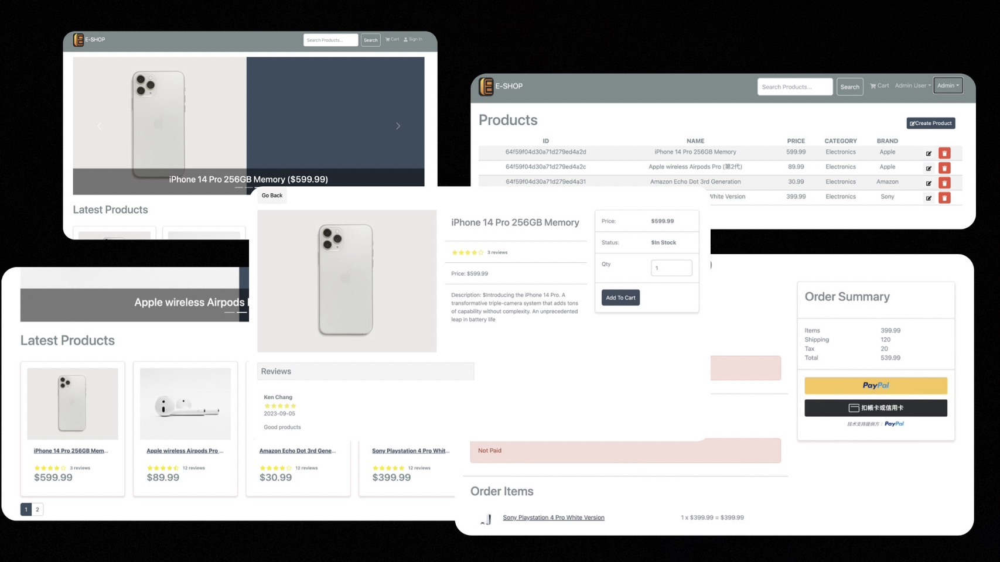

# E-SHOP e_Commerce Platform
> Demo Link: [E-SHOP-DEMO](https://e-shop-a0pc.onrender.com/)

> Platform built with MongoDB, Express, React and Node && Redux Toolkit



## Features

> Users
- Experience process of shopping cart (shipping, payment, method etc.)
- Product reviews && rating
- Top products carousel
- Pagination for products
- Searching products with keywords
- Check order history and change user info in profile
- Paypal / credit card integration
  
> Admin
- View all products list && create product
- View all users list && management
- View all order list && mark order as delivered
- Database seeder

## ENV Variables

Check .env.example for your reference, and add your own `MONGODB_URI` && `PAYPAL_CLIENT_ID`

```
NODE_ENV=production
MONGO_URI=SKIP
PORT=5001
JWT_SECRET=SKIP
PAYPAL_CLIENT_ID=SKIP
PAGINATION_LIMIT=SKIP
```

Change your `JWT_SECRET` && `PAGINATION_LIMIT`whatever you want

## Install Dependencies (frontend && backend)

```
npm install
cd frontend
npm install
```

## Run

```
# Run frontend(port:3000) && backend(port:5001)
npm run dev

# frontend only
npm run start

# backend only
npm run server
```

## Build & Deploy

```
# Create frontend production build
cd frontend
npm run build
```

## Seeder

```
# Import data
npm run data:import

# Destroy data
npm run data:destroy

```

```

# Sample admin
Account: admin@example.com
Password: 123456

# Sample user
Account: james@example.com
Password: 123456

```
